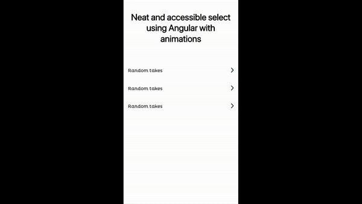

# Source code from the dev.to post

[Neat and accessible select using Angular with animations (Part 1)](https://dev.to/fidele137/awesome-select-using-angular-with-animations-4b2d-temp-slug-1233045?preview=5c9aad1dc3f54887990e0fd3e519229cb00c9534f50bc592a92b3b9e9edef376239aca8f50a0ab40b8c14b526fcbb530b8d02f3a1fb32c2d33f4ac28)



# Status

This is still a work in progress, the post is not published yet. It will be avaiable someday during this week.

# Run

```bash
npm run start
```

# Credits

- Design by [Pierre HUARD](https://www.linkedin.com/in/pihuard/)
- Code by [Fidèle PALOUKI](https://twitter.com/frontdatacloud)
